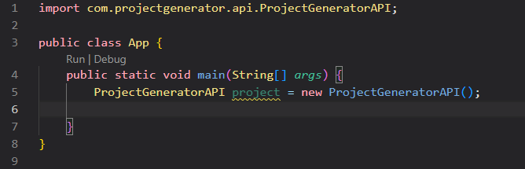

# Project Generator API

## Prerequisites to use API
	- Installed JDK (Java Development Kit)
	- Installed Gradle

## Add ProjectGeneratorAPI to Java project

### Add this in build.gradle.kts (Kotlin DSL):
    repositories {
        mavenCentral()  
        maven("https://jitpack.io")
    }

    dependencies { 
        implementation("com.github.HampusKalmar:Laboration-2-module:v1.1.4")
    }

### Add this in build.gradle (Groovy):
    dependencies {
        implementation 'com.github.HampusKalmar:Laboration-2-module:v1.1.4'
    }

    repositories {
        mavenCentral()
        maven { url 'https://jitpack.io' }
    }

## Link to JitPack.io
[Link to JitPack.io](https://jitpack.io/#HampusKalmar/Laboration-2-module)

## API Usage

### Import in your project

### Create a directory
ProjectGeneratorAPI project = new ProjectGeneratorAPI();
project.createDirectory("path/to/directory", "myNewDirectory");

### Create a file with content 
ProjectGeneratorAPI projec = new ProjectGeneratorAPI();
project.createFileWithContent("path/to/directory", "myNewFile.txt", "Hello World!");

### Search for a file
ProjectGeneratorAPI project = new ProjectGeneratorAPI();
project.findSearchedFile("path/to/directory", "myFile.txt");

### Print directory content
ProjectGeneratorAPI project = new ProjectGeneratorAPI();
project.printDirectoryContent("path/to/directory");

### Delete a file 
ProjectGeneratorAPI project = new ProjectGeneratorAPI();
project.deleteFile("path/to/directory", "myFile.txt")

### Print out file size
ProjectGeneratorAPI project = new ProjectGeneratorAPI();
project.showFileSize("path/to/file");

## Run tests
    - Clone this repository down to your computer.
    - Run "./gradlew test" in the console.
    - See the result.