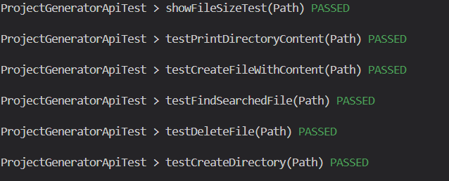

# Testrapport Laboration-2

## Testning av metoder i ProjectGeneratorAPI (JUnit)

### createDirectory()
Vad den gör: Metoden skapar upp en tillfällig katalog genom att anropa metoden 'createDirectory()'.

Test strategi: Använder sig av JUnits @TempDir för att skapa en tillfällig katalog och       försöker sedan skapa en ny katalog inuti den. Validerar om katalogen verkligen skapades.

Resultat: Testet gick igenom (se bild för ProjectGeneratorAPI).

### createFileWithContent()
Vad den gör: Skapar en fil med specificerat innehåll i en given katalog.

Test strategi: Skapar först en katalog och försöker sedan skapa en fil med angivet innehåll i den. Kontrollerar om filen finns och om det är en vanlig fil.

Resultat: Testet gick igenom (se bild för ProjectGeneratorAPI).

### findSearchedFile()
Vad den gör: Hittar filen i den angivna katalogen som användaren har angett.

Test strategi: Skapar en fil och försöker sedan hitta den med metoden som finns i ProjectGeneratorAPI. Bekräftar sedan om filen finns.

Resultat: Testet gick igenom (se bild för ProjectGeneratorAPI).

### printDirectoryContent()
Vad den gör: Visar upp innehållet i en katalog i konsolen.

Test strategi: Konfigurerar en katalog med filer och kataloger. Fångar informationen som ges ut i konsolen medan metoden körs och jämför sedan utgången med det förväntade resultatet.

Resultat: Testet gick igenom (se bild för ProjectGeneratorAPI).

### deleteFile()
    - Vad den gör: Hittar en fil som är angiven och raderar sedan filen.

    - Test strategi: Skapar en fil och försöker sedan ta bort den med metoden som finns i ProjectGeneratorAPI. Verifierar sedan om filen verkligen raderades.

    - Resultat: Testet gick igenom (se bild för ProjectGeneratorAPI).

### showFileSize()
Vad den gör: Visar hur stor den angivna filen är i bytes.

Test strategi: Skapar en fil med känt innehåll. Sedan fångar upp konsolens utdata under tiden metoder körs och kontrollerar om den utskrivna storleken matchar den faktiska storleken.

Resultat: Testet gick igenom (se bild för ProjectGeneratorAPI).

## Resultat av automatiska enhetstester 

## ## Testning av metoder i ProjectGeneratorModel (JUnit)

### checkFileWithContent()