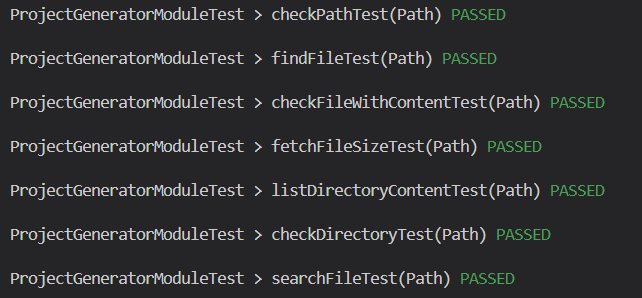

# Testrapport Laboration-2

## Testning av metoder i ProjectGeneratorAPI (JUnit)

### createDirectory()
Vad den gör: Metoden skapar upp en tillfällig katalog genom att anropa metoden 'createDirectory()'.

Test strategi: Använder sig av JUnits @TempDir för att skapa en tillfällig katalog och       försöker sedan skapa en ny katalog inuti den. Validerar om katalogen verkligen skapades.

Resultat: Testet gick igenom (se bild för ProjectGeneratorAPI).

### createFileWithContent()
Vad den gör: Skapar en fil med specificerat innehåll i en given katalog.

Test strategi: Skapar först en katalog och försöker sedan skapa en fil med angivet innehåll i den. Kontrollerar om filen finns och om det är en vanlig fil.

Resultat: Testet gick igenom (se bild för ProjectGeneratorAPI).

### findSearchedFile()
Vad den gör: Hittar filen i den angivna katalogen som användaren har angett.

Test strategi: Skapar en fil och försöker sedan hitta den med metoden som finns i ProjectGeneratorAPI. Bekräftar sedan om filen finns.

Resultat: Testet gick igenom (se bild för ProjectGeneratorAPI).

### printDirectoryContent()
Vad den gör: Visar upp innehållet i en katalog i konsolen.

Test strategi: Konfigurerar en katalog med filer och kataloger. Fångar informationen som ges ut i konsolen medan metoden körs och jämför sedan utgången med det förväntade resultatet.

Resultat: Testet gick igenom (se bild för ProjectGeneratorAPI).

### deleteFile()
Vad den gör: Hittar en fil som är angiven och raderar sedan filen.

Test strategi: Skapar en fil och försöker sedan ta bort den med metoden som finns i ProjectGeneratorAPI. Verifierar sedan om filen verkligen raderades.

Resultat: Testet gick igenom (se bild för ProjectGeneratorAPI).

### showFileSize()
Vad den gör: Visar hur stor den angivna filen är i bytes.

Test strategi: Skapar en fil med känt innehåll. Sedan fångar upp konsolens utdata under tiden metoder körs och kontrollerar om den utskrivna storleken matchar den faktiska storleken.

Resultat: Testet gick igenom (se bild för ProjectGeneratorAPI).

## Resultat av automatiska enhetstester 

## ## Testning av metoder i ProjectGeneratorModel (JUnit)

### checkFileWithContent()
Vad den gör: Verifierar om metoden checkFileWithContent skapar en fil med det angivna innehållet.

Test strategi: Använder sig av metoden för att skapa en fil med specifikt innehåll och validerar sedan både existensen av filen och dess innehåll.

Resultat: Testet gick igenom (se bild för ProjectGeneratorModel).

### checkPathTest()
Vad den gör: Verifierar sannolikt om en specifik sökväg pekar på en existerande fil eller katalog.

Test strategi: Använder metoden för att kontrollera en specifik fil i en temporär katalog. Därefter verifierar om filen existerar eller inte.

Resultat: Testet gick igenom (se bild för ProjectGeneratorModel).

### checkDirectoryTest()
Vad den gör: Verifierar om metoden checkDirectory skapar en katalog med det angivna namnet och kastar ett undantag när samma katalog försöker skapas igen.

Test strategi: Använder sig av metoden för att skapa en katalog i en temporär mapp och verifierar sedan att katalogen existerar. Försöker sedan skapa katalogen igen för att kontrollera att ett undantag kastas.

Resultat: Testet gick igenom (se bild för ProjectGeneratorModel).

### searchFileTest()
Vad den gör: Söker efter en fil med ett angivet namn i en specifik katalog.

Test strategi: Skapar en fil i en temporär katalog och använder sedan metoden för att söka efter den. Verifierar sedan att den hittade filen stämmer överens med det önskade namnet.

Resultat: Testet gick igenom (se bild för ProjectGeneratorModel).

### listDirectoryContent()
Vad den gör: Listar alla filer och kataloger inom en specifik katalog.

Test strategi: Skapar två filer i en temporär katalog och använder sedan metoden för att hämta innehållet i katalogen. Verifierar att de båda filnamnen finns i den returnerade listan.

Resultat: Testet gick igenom (se bild för ProjectGeneratorModel).

### findFileTest()
Vad den gör: Söker efter en specifik fil inom en katalog och returnerar sant om den finns, annars falskt.

Test strategi: Skapar en fil i en temporär katalog och använder sedan metoden för att söka efter den. Verifierar att metoden returnerar sant. Testar sedan att söka efter en fil som ej existerar och verifierar att metoden returnerar falskt.

Resultat: Testet gick igenom (se bild för ProjectGeneratorModel).

### fetchFileSizeTest()
Vad den gör: Hämtar storleken på en specifik fil i antal bytes.

Test strategi: Skapar en fil med känt innehåll i en temporär katalog och använder sedan metoden för att hämta filens storlek. Verifierar att den returnerade storleken motsvarar innehållets längd.

Resultat: Testet gick igenom (se bild för ProjectGeneratorModel).

## Resultat av automatiska enhetstester 

## För att testa modulen själv:

    - Klona ner modulen från Github
    - Kör "./gradlew test" i konsolen
    - Se resultatet